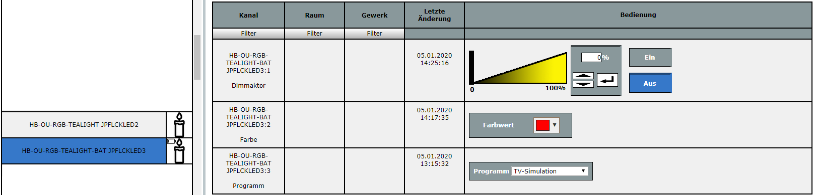
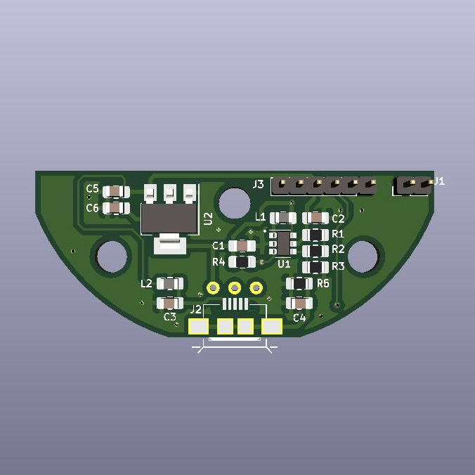

Dieses Werk ist lizenziert unter einer [Creative Commons Namensnennung - Nicht-kommerziell - Weitergabe unter gleichen Bedingungen 4.0 International Lizenz](http://creativecommons.org/licenses/by-nc-sa/4.0/).

# RGB-LED-Kerze mit Homematic-Anbindung

## Beschreibung:
Diese Projekt beschreibt den Aufbau eines RGB-LED Teelichts / einer RGB-LED Kerze mit Homematic-Anbindung. 
Die Leuchtfarbe ist über die WebUI einstellbar. 
Zusätzlich gibt es ein paar auswählbare Automatikprogramme (Farbdurchlauf / verschiedene Flacker-Programme). 
 
**Folgende Varianten können aufgebaut werden:** 
 
:arrow_right: LED-Teelicht mit bedrahteter 3mm Flacker-LED 
:arrow_right: RGB-LED-Teelicht mit WS2812 LED und Spannungsversorung über Micro-USB 
:arrow_right: RGB-Kerze mit WS2812 LED und Spannungsversorung wahlweise über Batterie ***oder*** Micro-USB
 
 
Die Spannungsversorung erfolgt bei der Teelicht-Variante über Micro-USB. 
Eine Batterieversion ist aktuell in Evaluierung. 
Da die CR2477 Batterie sich allerdings als ungeeignet erwiesen hat, wird diese eine größere Bauform haben und kein Teelicht mehr sein. 
Zusätzlich besteht auch noch die Möglichkeit die Platinen als "normales" LED-Teelicht mit bedrahteter Flacker-LED zu bestücken und zu betreiben. 
 

## Funktionen:
#### Hardware:
- Micro-USB-Anschluss zur Spannungsversorgung (je nach Variante). 
- 3pol Schiebeschalter auf der Batterieplatine: Ein- und Ausschalter (trennt die Batterie- bzw. USB-Spannung) 
- Config-Taster (Power-PCB). 
- Reset-Taster (Hauptplatine - optional) 
 

#### Software:
Der Sketch und das Addon für die Homematic wurde von Jerome entwickelt. 
Die Leuchtfarbe ist über die WebUI einstellbar. 
Zusätzlich gibt es ein paar auswählbare Automatikprogramme (Farbdurchlauf / verschiedene Flacker-Programme) 
 

 
 

## Platinen:
#### Hauptplatine:

 

#### Power-PCB Teelicht-Version:

 
Spannungsversorung wahlweise über Batterie (Version mit 3 mm Flacker-LED) ***oder*** Micro-USB (Version mit WS2812 LED). 
 

_Auf dieser Platine wäre ein Step-Up für den Betrieb mit einer CR2477 Batterie vorgesehen._
 
_Leider hat sich bei den Tests ergeben, dass die Batterie nur wenige Stunden hält. Aus diesem Grund wurde diese Lösung verworfen. 
Deshalb wird die Bestückung von diesem Teil der Platine auch nicht näher beschrieben._
 
 

#### Power-PCB Kerzen-Version:

 
Spannungsversorung wahlweise über Batterie ***oder*** Micro-USB 
 
